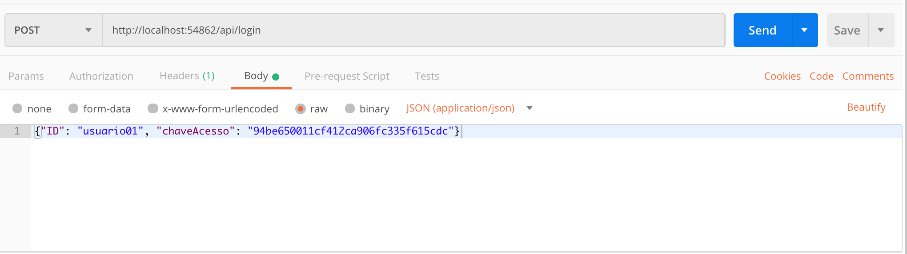
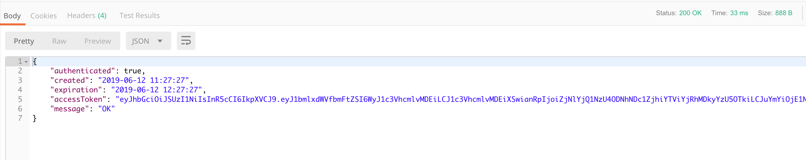
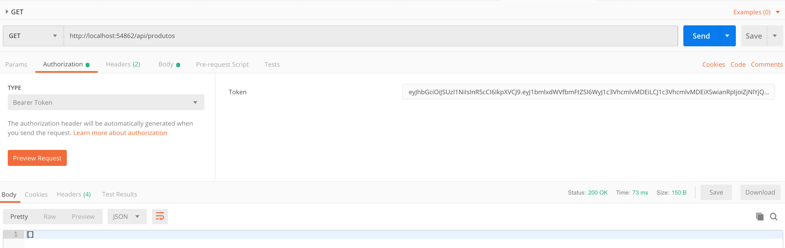

Tutorial sobre o uso de GraphQL

## GraphQL - LInguagem de Queries sobre HTTP

O GraphQL é uma linguagem de criação de APIs desenhada para executar comandos HTTP usando um sistema de tipos que você define para seus dados. Pense que é uma espécie de SQL para manipular APIs HTTP. Ela foi pelo Facebook em 2012 e três anos depois (2015) em um evento sobre React foi liberado para a comunidade. O GraphQL não está vinculado a nenhum banco de dados ou mecanismo de armazenamento específico.

Um serviço GraphQL é criado definindo tipos e campos nesses tipos e, em seguida, fornecendo funções para cada campo em cada tipo. Por exemplo, um serviço GraphQL que nos diz quem é o usuário logado (eu) e também o nome desse usuário pode ser algo como isto:

```graphql
type Query {
  me: User
}

type User {
  id: ID
  name: String
}
```

Uma vez que um serviço GraphQL está sendo executado (geralmente em uma URL em um serviço da web), ele pode enviar consultas GraphQL para validar e executar. Uma consulta recebida é primeiro verificada para garantir que ela se refira apenas aos tipos e campos definidos e, em seguida, executa as funções fornecidas para produzir um resultado.

POr exemplo a query abaixo 

```graphql
{
  me {
    name
  }
}
```

produziria o resultado

```json
{
  "me": {
    "name": "Darth Vader"
  }
}
```

O GraphQL é uma alternativa ao modelo REST. Abaixo comparamos e apresentamos vantagens e desvantagens.

| REST                                    | GraphQL                                                      |
| --------------------------------------- | ------------------------------------------------------------ |
| Requisição a mais de uma rota           | Somente uma rota                                             |
| API's grandes tem muitos endpoints      | Somente um endpoint                                          |
| Tráfego fixo de dados                   | Cliente solicita apenas o necessário                         |
| Contratos de dados fixos                | Contratos de dados variáveis, conforme a consulta do usuário |
| Contrato de negócio explícito (RESTful) | Sem contratos de negócio.                                    |


## Projeto Exemplo com Autenticação JWT

Para pular a etapa de criação de um novo projeto, vamos utilizar um projeto base que você pode clonar a partir do seguinte endereço: [ASPNETCore2_CRUD-API-JWT-EFInMemory](https://github.com/renatogroffe/ASPNETCore2_CRUD-API-JWT-EFInMemory).

---

Se você não trabalhou ainda com autenticação baseada em JWT, fornecerei abaixo uma dica de como rodar esse projeto. Caso já conheça esse conceito, pode avançar no tutorial para a próxima seção.

O uso do padrão aberto conhecido como [**JSON Web Tokens (JWT)**](https://jwt.io/) corresponde a uma das práticas mais difundidas visando o acesso seguro a APIs. Esta abordagem se vale de **tokens** criptografados para assim liberar a utilização de recursos de uma API, sendo que tal técnica recebeu o nome de **Bearer Authentication**.

Um token baseado na especificação **JWT** é formado por 3 partes, cada uma delas separadas por ponto:

**xxxxx.yyyyy.zzzzz**

As diferentes partes envolvidas são

1. **Header**: cabeçalho contendo o tipo do token (**JWT**) e o mecanismo de criptografia utilizado (**HMAC** ou **RSA**);
2. **Payload**: conjunto de claims associadas ao usuário referenciado pelo token;
3. **Signature**: assinatura empregada na validação do token, dependendo para isto de uma chave controlada pela aplicação que faz uso deste mecanismo de autenticação.

No próprio site da especificação **JWT** existe um [**debbuger**](https://jwt.io/#debugger) que permite analisar este conteúdo:


E como funcionaria exatamente a autenticação via token? Este processo envolve as seguintes etapas:

1. Uma requisição HTTP do tipo **POST** é enviada a um sistema Web, podendo conter em seu corpo informações como usuário e/ou chaves/senhas de acesso;
2. Caso as credenciais sejam válidas um token baseado na especificação JWT é gerado;
3. O token é então devolvido à aplicação que encaminhou a requisição. Importante destacar que essa estrutura (token) possui uma validade, expirando após um período de tempo estabelecido previamente. Todo este processo é **stateless**, ou seja, ocorre sem o armazenamento de estados na memória do servidor. A opção por um token dispensa também múltiplas pesquisas a um repositório com credenciais de acesso (um banco de dados, por exemplo), contribuindo assim para uma maior performance no uso de APIs REST;
4. Requisições a recursos de APIs REST da aplicação Web conterão no header o token obtido anteriormente;
5. O token informado na seção **Authorization** do header é então analisado.
6. Caso seja válido, o acesso ao recurso é então liberado. Uma resposta é devolvida então como resultado de um processamento na API REST.

Na imagem a seguir está uma representação esquemática deste processo:


A nova plataforma Web da Microsoft também suporta **JWT** como mecanismo de autenticação em APIs REST. Para isso você deve executar o exemplo baixado da seguinte forma. Abra a ferramenta Postman e faça uma requisição post conforme os parâmetros abaixo.



O resultado será similar ao mostrado abaixo, que mostra que o usuário foi autenticado e um token foi gerado.



Com o Token em mãos, você pode agora fazer as chamadas as rotas da sua aplicação. Mas para isso você deve sempre passar o token conforme parametrização abaixo, onde informamos na aba da autorização que queremos usar o token do tipo Bearer e copiar e colar o token no campo disponível.



Conforme visto acima, quando passamos o token o resultados retornado tem código 200 e a API é chamada normalmente.

---


## GraphQL em ASP.NET Core

Com o projeto clonado, vamos adicionar as referências necessárias para trabalhar com GraphQL. Para isso, execute os comandos abaixo no seu terminal dentro do diretório raiz do projeto baixa

```bash
dotnet add package graphQL 
dotnet add package graphiql
```

O próximo passo será criar uma **Type** para a nossa entidade Produto. Basicamente, as types são os mapeamentos das nossas entidades com o GraphQL

Crie um novo diretório dentro de **Models** chamado **GraphQL**, e dentro dele uma classe chamada **ProdutoType**. Em seguida, atualize-o com o trecho de código abaixo:

```csharp
public class ProdutoType : ObjectGraphType<Produto>
    {
        public ProdutoType()
        {
            Name = "Produto";
            
            Field(x => x.CodigoBarras).Description("Código de Barras");

            Field(x => x.Nome).Description("Nome do produto");

            Field(x => x.Preco).Description("Preço");

        }
 }
```

Analisando o trecho de código acima, nós temos:

- qual é a entidade que será mapeada para o nosso Type
- o nome do type para pesquisas
- os campos do type com uma breve descrição de cada um deles

Com o type criado nós precisamos criar dois novos arquivos: um para as nossas queries chamado **EatMoreQuery.cs** e outro chamado **GraphQLQuery.cs** para os argumentos da nossa pesquisa.

Crie um novo diretório chamado **Queries**, e dentro dele os dois arquivos mencionados acima: **EatMoreQuery.cs** e **GraphQLQuery.cs**. Em seguida atualize-os com os trechos de código abaixo:

**GraphQLQuery.cs**

```csharp
public class GraphQLQuery
    {
        public string OperationName { get; set; }
        public string NamedQuery { get; set; }
        public string Query { get; set; }
        public JObject Variables { get; set; }
    }
```

**EatMoreQuery.cs**

```csharp
 public class EatMoreQuery : ObjectGraphType
    {
        public EatMoreQuery(ApplicationDbContext db)
        {

            Field<ListGraphType<ProdutoType>>(
                "produtos",
                resolve: context =>
                {
                    var produtos = db
                    .Produtos;
                    return produtos;
                });

        }
    }
```

Analisando o trecho de código acima, temos:

- **01**: instância da classe **ObjectGraphType**
- **02**: construtor recebendo o Contexto do Entity Framework Core
- **06**: estamos passando que o nosso método retornará uma lista de objetos do tipo ProdutoType
- **07**: nome que usaremos para nossa chamada
- **08**: resolve com o contexto do nosso banco de dados. Aqui mapearemos a requisição do nosso cliente com os dados do nosso banco de dados. Como db é o contexto do Entity Framework, podemos acessar a partir dele as entidades mapeadas do nosso banco

O próximo passo será criar uma **rota (endpoint)** para as nossas pesquisas. Para isso, crie uma nova Controller chamada GraphQLController e atualize-a com o trecho de código abaixo:

```csharp
    [Route("graphql")]
    public class GraphQLController : Controller
    {

        private readonly ApplicationDbContext _db;

        public GraphQLController(ApplicationDbContext db)
        {
            _db = db;
        }

        public async Task<IActionResult> Post([FromBody]GraphQLQuery query)
        {
            var inputs = query.Variables.ToInputs();

            var schema = new Schema()
            {
                Query = new EatMoreQuery(_db)
            };

            var result = await new DocumentExecuter().ExecuteAsync(_ =>
            {
                _.Schema = schema;
                _.Query = query.Query;
                _.OperationName = query.OperationName;
                _.Inputs = inputs;
            }).ConfigureAwait(false);

            if (result.Errors?.Count > 0)
            {
                return BadRequest();
            }

            return Ok(result);
        }
    }
```

Analisando o trecho de código acima, nós temos:

- **05 a 10**: Injeção do DbContext no nosso controlador
- **14**: Recepção dos valores da pesquisa
- **16 a 19**: Passagem do contexto para os Schemas do GraphQL
- **37 a** **40**: Passagem dos parâmetros da nossa pesquisa

Agora, para termos uma carga inicial para utilizar nas nossas pesquisas, abra o arquivo Startup.cs e atualize o método **Configure** com o trecho de código abaixo que irá povoar produtos no banco de dados.

```csharp
public void Configure(IApplicationBuilder app, IHostingEnvironment env,
            UsuarioService usrService, ProdutoService produtoService)
        {
            usrService.Incluir(
                new Usuario() { ID = "usuario01", ChaveAcesso = "94be650011cf412ca906fc335f615cdc" });

            usrService.Incluir(
                new Usuario() { ID = "usuario02", ChaveAcesso = "531fd5b19d58438da0fd9afface43b3c" });

            produtoService.Incluir(
                new Produto { CodigoBarras = "11111111111", Nome = "Produto01", Preco = 579 }
                );

            produtoService.Incluir(
              new Produto { CodigoBarras = "2222222222", Nome = "Produto02", Preco = 579 }
              );

            produtoService.Incluir(
              new Produto { CodigoBarras = "333333333333", Nome = "Produto03", Preco = 579 }
              );

            produtoService.Incluir(
              new Produto { CodigoBarras = "4444444444", Nome = "Produto04", Preco = 579 }
              );

            produtoService.Incluir(
              new Produto { CodigoBarras = "5555555555", Nome = "Produto05", Preco = 579 }
              );

            produtoService.Incluir(
              new Produto { CodigoBarras = "66666666666", Nome = "Produto06", Preco = 579 }
              );

            produtoService.Incluir(
              new Produto { CodigoBarras = "77777777777", Nome = "Produto07", Preco = 579 }
              );

            produtoService.Incluir(
              new Produto { CodigoBarras = "888888888888", Nome = "Produto08", Preco = 579 }
              );

            produtoService.Incluir(
              new Produto { CodigoBarras = "99999999999", Nome = "Produto09", Preco = 579 }
              );

            produtoService.Incluir(
              new Produto { CodigoBarras = "10101010101010101010", Nome = "Produto10", Preco = 579 }
              );

            if (env.IsDevelopment())
            {
                app.UseDeveloperExceptionPage();
            }

            app.UseMvc();
        }
```

## Testando o projeto

Para validar os passos anteriores eu irei utilizar o Postman, mas você pode utilizar uma outra ferramenta de testes HTTP de sua preferência.

Com o projeto rodando, abra sua ferramenta de testes HTTP e configure ela conforme na imagem abaixo:


A pesquisa anterior está simples. Caso execute, ela notará que retornaram todos os nomes que foram inseridos na nossa tabela em memória. Caso queira trazer também o código de barras e o preço dos produtos, basta adicionar eles depois de nome entre virgulas. Abaixo você tem uma imagem demonstrando esse passo:


