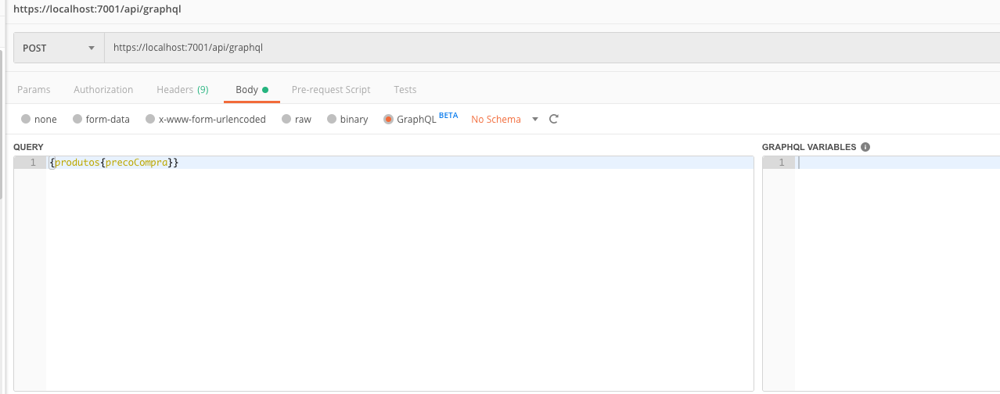

## Implementando GraphQL

Nesta parte, implementaremos o GraphQL em nossa API, passando por cada um dos projetos criados anteriormente.

Com o projeto clonado, vamos adicionar as referências necessárias para trabalhar com GraphQL. Para isso, execute os comandos abaixo no seu terminal dentro do diretório raiz do projeto baixa

```
dotnet add package graphQL 
dotnet add package graphiql
```

O próximo passo será criar uma **Type** para a nossa entidade Produto. Basicamente, as types são os mapeamentos das nossas entidades com o GraphQL

Crie um novo diretório dentro de **Domain** chamado **GraphQL**, e dentro dele uma classe chamada **ProdutoType**. Em seguida, atualize-o com o trecho de código abaixo:

```c#
using System;
using GraphQL;
using GraphQL.Types;
using Final.Domain.Entities;

namespace Final.Domain.GraphQL
{
    public class ProdutoType : ObjectGraphType<Produto>
    {
        public ProdutoType()
        {
            Name = "Produto";
            
            Field(x => x.Sku).Description("Código do produto");

            Field(x => x.Codigo).Description("Código interno");

            Field(x => x.Name).Description("Nome do produto");

            Field(x => x.PrecoCompra).Description("Preço de Compra");

            Field(x => x.PrecoVenda).Description("Preço de Venda");

        }
    }
}
```

Analisando o trecho de código acima, nós temos:

- qual é a entidade que será mapeada para o nosso Type

- o nome do type para pesquisas

- os campos do type com uma breve descrição de cada um deles

  

Agora, no projeto de Infra.Data, vamos criar a parte do GraphQL responsável por gerenciar as Queryes.

Com o type criado nós precisamos criar dois novos arquivos no Infra.Data: um para as nossas queries chamado **EatMoreQuery.cs** e outro chamado **GraphQLQuery.cs** para os argumentos da nossa pesquisa.

Crie um novo diretório chamado **Queries**, e dentro dele os dois arquivos mencionados acima: **EatMoreQuery.cs** e **GraphQLQuery.cs**. Em seguida atualize-os com os trechos de código abaixo:

**GraphQLQuery.cs**

```c#
using GraphQL;

namespace Final.Infra.Data.Queries
{
    public class GraphQLQuery
    {
        public string OperationName { get; set; }
        public string NamedQuery { get; set; }
        public string Query { get; set; }
        public JObject Variables { get; set; }
    }
}
```

**EatMoreQuery.cs**

```c#
using Final.Domain.Entities;
using Final.Domain.GraphQL;
using Final.Domain.Interfaces;
using Final.Infra.Data.Context;
using Final.Infra.Data.Queries;
using System;
using System.Collections.Generic;
using System.Linq;
using System.Text;
using GraphQL;
using GraphQL.Types;

namespace Final.Infra.Data.Queries
{
    public class EatMoreQuery : ObjectGraphType
    {
        protected SQLiteContext sqliteContext = new SQLiteContext();

        public EatMoreQuery()
        {

            Field<ListGraphType<ProdutoType>>(
                "produtos",
                resolve: context =>
                {
                    var produtos = sqliteContext
                    .Produto;
                    return produtos;
                });

        }
    }
}
```

Analisando o trecho de código acima, temos:

- **01**: instância da classe **ObjectGraphType**
- **06**: estamos passando que o nosso método retornará uma lista de objetos do tipo ProdutoType
- **07**: nome que usaremos para nossa chamada
- **08**: resolve com o contexto do nosso banco de dados. Aqui mapearemos a requisição do nosso cliente com os dados do nosso banco de dados. Como db é o contexto do Entity Framework, podemos acessar a partir dele as entidades mapeadas do nosso banco


O próximo passo será criar uma **rota (endpoint)** para as nossas pesquisas no projeto `Final.Application`.

Para começar, será necessário adicionar a dependência do projeto `Final.Infra.Data` e do `GraphQL`, executando os comandos na raiz da solução:

```
dotnet add Final.Application/*.csproj reference Final.Infra.Data/*.csproj
cd Final.Application
dotnet add package graphQL
```


 Para isso, crie uma nova Controller chamada GraphQLController e atualize-a com o trecho de código abaixo:

```c#
  using System;
using System.Collections.Generic;
using System.Linq;
using System.Threading.Tasks;
using Microsoft.AspNetCore.Mvc;
using Final.Domain.Entities;
using Final.Service.Services;
using Final.Service.Validators;
using GraphQL;
using Final.Infra.Data.Queries;
using GraphQL.Types;


namespace Final.Application.Controllers
{
    [Route("api/graphql")]
    public class GraphQLController : Controller
    {
        public async Task<IActionResult> Post([FromBody]GraphQLQuery query)
        {
            var inputs = query.Variables.ToInputs();

            var schema = new Schema()
            {
                Query = new EatMoreQuery()
            };

            var result = await new DocumentExecuter().ExecuteAsync(_ =>
            {
                _.Schema = schema;
                _.Query = query.Query;
                _.OperationName = query.OperationName;
                _.Inputs = inputs;
            }).ConfigureAwait(false);

            return Ok(result);
        }
    }
}
```

Analisando o trecho de código acima, nós temos:

- **05 a 10**: Injeção do DbContext no nosso controlador
- **14**: Recepção dos valores da pesquisa
- **16 a 19**: Passagem do contexto para os Schemas do GraphQL
- **37 a** **40**: Passagem dos parâmetros da nossa pesquisa


Agora, ao realizar a chamada com o Postman, temos o seguinte:




