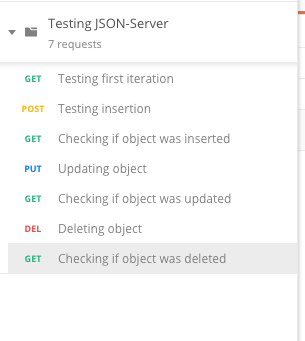
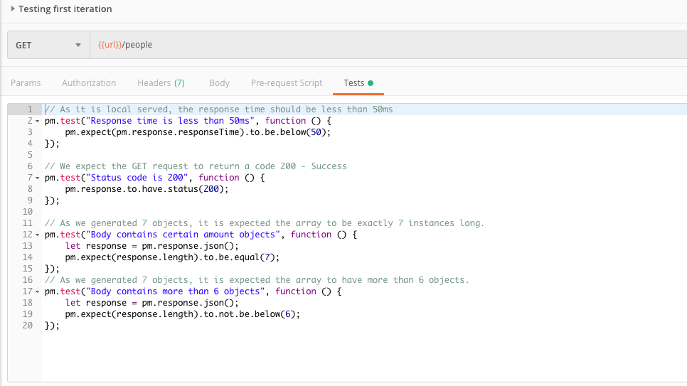

### Testando com Postman

Uma lida rápida em meu post no Medium sobre [Testes com Postman](https://medium.com/@arthurgomesfaria/automating-apis-testing-with-postman-and-newman-a9a9ef0354d4) é recomendada.

Vamos começar então, baixando os arquivos do repositório: https://github.com/tutagomes/Postman-Testing e adicionando-os ao Postman, através do menu de importação.

Ao importar, teremos então uma nova coleção no Postman, contendo vários métodos já programados:

Além de cada método conter testes, como por exemplo o `GET - Testing first iteration`:

