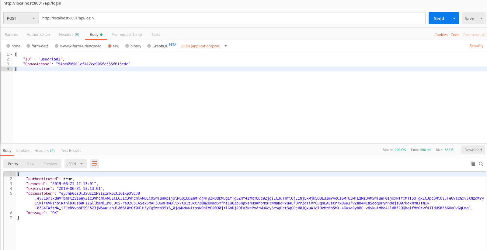
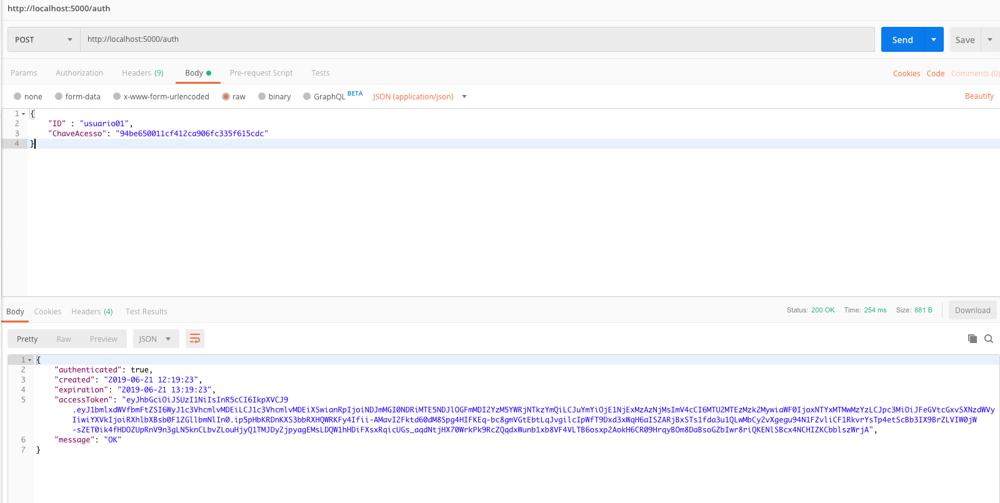

### Autenticação

Até agora nos laboratórios, foram poucas as ocasiões em que utilizamos a autenticação para proteger acessos. O objetivo desta parte é baixar o projeto já utilizado anteriormente do Renato Groffe e verificar seu funcionamento correto. 

Podemos realizar o download do repositório executando o comando:

```sh
git clone https://github.com/renatogroffe/ASPNETCore2_CRUD-API-JWT-EFInMemory
```


Note que o projeto vem completo, com uma APIProduto contendo controladores não exclusivos da autenticação. Para remover a funcionalidade de uma forma prática e rápida, vamos simplemente excluir o arquvio `ProdutosController.cs` da pasta `Controllers`. Desta forma, embora a funcionalidade ainda exista, estaremos bloqueando o acesso externo aos métodos.

E claro, para não haver confusão de portas, vamos simplesmente editar o arquivo `Properties/launchSettings.json` e trocar a porta para 8001, ficando então:

```json
"APIProdutos": {
      "commandName": "Project",
      "launchBrowser": true,
      "launchUrl": "api/produtos",
      "environmentVariables": {
        "ASPNETCORE_ENVIRONMENT": "Development"
      },
      "applicationUrl": "http://localhost:8001/"
      }
```


Agora, podemos executá-lo navegando até a pasta do projeto e executando o comando `dotnet run`.

Assim, será possível testar utilizando o Postman, criando uma nova request POST e adicionando ao body do request o JSON:

```json
{ 
	"ID" : "usuario01",
	"ChaveAcesso": "94be650011cf412ca906fc335f615cdc"
}
```



Agora com o funcionamento correto da API de autenticação, vamos então configurá-la no Ocelot.

No projeto do Gateway, anteriormente havíamos criado um arquivo `configuration.json`. Vamos editá-lo então para receber um novo roteamento, da API de Autenticação.

```json
{
        "DownstreamPathTemplate": "/api/login",
        "DownstreamScheme": "http",
        "DownstreamHostAndPorts": [
          {
            "Host": "127.0.0.1",
            "Port": 8001
          }
        ],
        "UpstreamPathTemplate": "/auth",
        "UpstreamHttpMethod": [ "Get", "Post", "Put", "Delete", "Options" ]
      }
```

Desta forma, ao acessar http://localhost:5000/auth, seremos direcionado para http://localhost:8001/api/login. Podemos então testar através do Postman:

