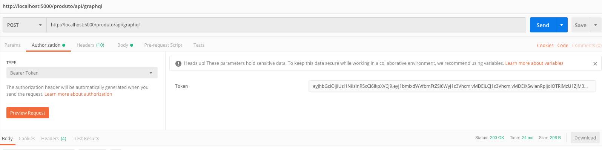
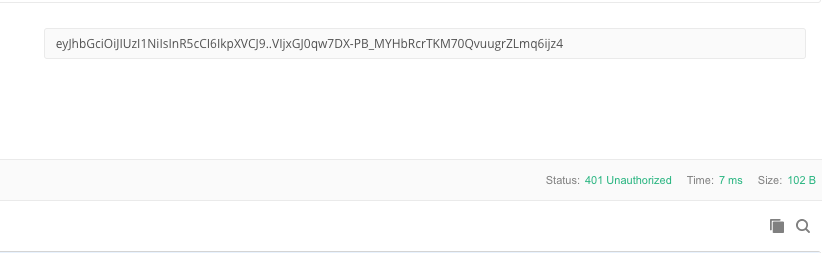

### Protegendo Rotas com JWT

Ao implementar autenticação/autorização em um serviço, pode ser comum ver cada um ter sua própria instância de autenticação. Como por exemplo, o código do repositório do Groffe utilizado anteriormente, junta duas APIS em um só projeto.

Mas imagine que você tenha uma grande quantidade de APIs expostas através do seu Gateway, você implementaria a autenticação em cada uma delas?

É aí que entra a proteção de rotas do Ocelot. Desta forma, podemos gerar um token através de uma API de autenticação (montada no passo anterior) e utilizamos um interceptador no Ocelot para verificar se aquele token é válido ou não antes de direcionar a chamada à API.

Note que para o Ocelot ser capaz de verificar se a assinatura é válida, ele precisa saber os parâmetros dela, por isso, vamos ter que alterar um pouco como o Token é gerado no LoginController da aplicação APIProduto.


#### Alterando Login Controller

Sem modificações, cada vez que a aplicação fosse executada, seria criada uma chave nova de assinatura, sendo então difícil utilizar a verificação fora do próprio serviço.

Então, estabelecemos uma `SymetricSecurityKey` para facilitar o processo.

```c#
 var key =  new SymmetricSecurityKey(Encoding.ASCII.GetBytes("MDswDQYJKoZIhvcNAQEBBQADKgAwJwIgbkH7gXvTnAuX98lvYHrJ9Yvv4s7lFp3m0f/yp6c5yi8CAwEAAQ=="));
                var credentials = new SigningCredentials(key, SecurityAlgorithms.HmacSha256);

var handler = new JwtSecurityTokenHandler();
var securityToken = handler.CreateToken(new SecurityTokenDescriptor
                {
                    Issuer = tokenConfigurations.Issuer,
                    Audience = tokenConfigurations.Audience,
                    SigningCredentials = credentials,
                    Subject = identity,
                    NotBefore = dataCriacao,
                    Expires = dataExpiracao
                });
var token = handler.WriteToken(securityToken);
```

Desta forma, teremos em mão o segredo utilizado para gerar o token e podemos implementá-lo na instância do Ocelot.


#### Alterando Ocelot - Startup

```c#
public void ConfigureServices(IServiceCollection services)
{
  var signingKey = new SymmetricSecurityKey(Encoding.ASCII.GetBytes("MDswDQYJKoZIhvcNAQEBBQADKgAwJwIgbkH7gXvTnAuX98lvYHrJ9Yvv4s7lFp3m0f/yp6c5yi8CAwEAAQ=="));
  var tokenValidationParameters = new TokenValidationParameters
  {
    ValidateIssuerSigningKey = true,
    IssuerSigningKey = signingKey,
    ValidateIssuer = true,
    ValidIssuer = "ExemploIssuer",
    ValidateAudience = true,
    ValidAudience = "ExemploAudience",
    ValidateLifetime = true,
    ClockSkew = TimeSpan.Zero,
    RequireExpirationTime = true,
  };

  services.AddAuthentication(o =>
                             {
                               o.DefaultAuthenticateScheme = "TestKey";
                             })
    .AddJwtBearer("TestKey", x =>
                  {
                    x.RequireHttpsMetadata = false;
                    x.TokenValidationParameters = tokenValidationParameters;
                  });
  // services.AddMvc().SetCompatibilityVersion(CompatibilityVersion.Version_2_2);
  services.AddOcelot(Configuration);
}
```

Aqui, configuramos então um padrão de autenticação chamado TestKey, responsável por validar uma chamada utilizando como parâmetro a chave gerada através do segredo.

Também é possível verificar o Issuer e a Audience, como um passo adicional de segurança.

Por último, vamos então alterar o `configuration.json` para modificar as rotas de `produto` para serem autenticadas, deixando-o então no formato:

```json
{
        "DownstreamPathTemplate": "/",
        "DownstreamScheme": "http",
        "DownstreamHostAndPorts": [
          {
            "Host": "127.0.0.1",
            "Port": 7000
          }
        ],
        "UpstreamPathTemplate": "/produto/",
        "UpstreamHttpMethod": [ "Get", "Post", "Put", "Delete", "Options" ],
        "AuthenticationOptions": {
          "AuthenticationProviderKey": "TestKey",
          "AllowedScopes": []
      }
      },
      {
        "DownstreamPathTemplate": "/{everything}",
        "DownstreamScheme": "http",
        "DownstreamHostAndPorts": [
          {
            "Host": "127.0.0.1",
            "Port": 7000
          }
        ],
        "UpstreamPathTemplate": "/produto/{everything}",
        "UpstreamHttpMethod": [ "Get", "Post", "Put", "Delete", "Options" ],
        "AuthenticationOptions": {
          "AuthenticationProviderKey": "TestKey",
          "AllowedScopes": []
      }
      },
```

Desta forma, o processo de chama só continua se as chaves do Header passarem pelo processo de verificação.

Colocando então o token na aba de autenticação, podemos chamar a API de Produtos tranquilamente.




Caso o token seja inválido, teremos uma resposta do tipo 401, Unauthorized.


