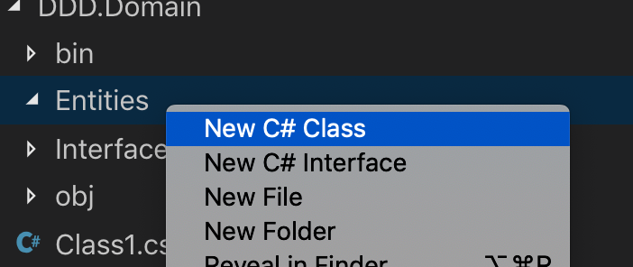

### Introdução Sobre DDD


> 1. Camada de aplicação: responsável pelo projeto principal, pois é onde será desenvolvido os controladores e serviços da *API*. Tem a função de receber todas as requisições e direcioná-las a algum serviço para executar uma determinada ação. 
>    *Possui referências das camadas Service e Domain.*
> 2. Camada de domínio: responsável pela implementação de classes/modelos, as quais serão mapeadas para o banco de dados, além de obter as declarações de interfaces, constantes, *DTOs* (*Data Transfer Object*) e *enums*.
> 3. Camada de serviço: seria o “coração” do projeto, pois é nela que é feita todas as regras de negócio e todas as validações, antes de persistir os dados no banco de dados. 
>    *Possui referências das camadas Domain, Infra.Data e Infra.CrossCutting.*
> 4. Camada de infraestrutura: é dividida em duas sub-camadas
>    \- Data: realiza a persistência com o banco de dados, utilizando, ou não, algum *ORM*.
>    \- Cross-Cutting: uma camada a parte que não obedece a hierarquia de camada. Como o próprio nome diz, essa camada cruza toda a hierarquia. Contém as funcionalidades que pode ser utilizada em qualquer parte do código, como, por exemplo, validação de CPF/CNPJ, consumo de API externa e utilização de alguma segurança.
>    *Possui referências da camada Domain.*


#### 1. Criando a Solução

Primeiro, vamos criar a solução principal, que armazenará todos os projetos de cada camada da nossa aplicação. Para simplificar, vamos chamar a solução de DDD:

```bash
dotnet new sln -o DDD
cd DDD
```

Com a solução criada, vamos adicionar o primeiro projeto, responsável por expor a aplicação ao mundo, que é do tipo `webapi`. Através desta interface, será possível acessar as camadas mais inferiores da aplicação.

> Esta camada será complementada ao final do laboratório, expondo os serviços criados ao decorrer da prática para o mundo externo.

```sh
dotnet new webapi -o DDD.Application -f netcoreapp2.2

# E claro, além de criar, vamos referencià-la também à nossa solução, com o comando
dotnet sln DDD.sln add DDD.Application/DDD.Application.csproj
```

Para executar o projeto acima estando na pasta da solução, basta entrar o comando:

```sh
dotnet run --project DDD.Application/DDD.Application.csproj
```


#### 2. Implementando Camada - Domain

> ##### A camada de modelo de domínio
>
> O excelente livro de Eric Evans, [Domain Driven Design](https://domainlanguage.com/ddd/) (Projeto Orientado a Domínio) diz o seguinte sobre a camada de modelo de domínio e a camada de aplicativo.
>
> **Camada de modelo de domínio**: Responsável por representar conceitos dos negócios, informações sobre a situação de negócios e as regras de negócios. O estado que reflete a situação de negócios é controlado e usado aqui, embora os detalhes técnicos de armazená-lo sejam delegados à infraestrutura. Essa camada é a essência do software de negócios.
>
> A camada de modelo de domínio é onde os negócios é expresso. Quando você implementa uma camada de modelo de domínio de microsserviço em .NET, essa camada é codificada como uma biblioteca de classes com as entidades de domínio que capturam dados mais comportamento (métodos com lógica).
>
> Seguindo os princípios de [Ignorância da Persistência](https://deviq.com/persistence-ignorance/) e a [Ignorância da Infraestrutura](https://ayende.com/blog/3137/infrastructure-ignorance), essa camada deve ignorar totalmente os detalhes de persistência de dados. Essas tarefas de persistência devem ser executadas pela camada de infraestrutura. Portanto, essa camada não deveria receber dependências diretas da infraestrutura, o que significa que uma regra importante é que suas classes de entidade do modelo de domínio devem ser [POCO](https://en.wikipedia.org/wiki/Plain_Old_CLR_Object)s.
>
> Entidades de domínio não devem ter nenhuma dependência direta (como derivar de uma classe base) em nenhuma estrutura de infraestrutura de acesso a dados, como Entity Framework ou NHibernate. Idealmente, suas entidades de domínio não devem derivar nem implementar nenhum tipo definido em nenhuma estrutura de infraestrutura.
>
> As estruturas ORM mais modernas, como Entity Framework Core, permitem essa abordagem, de modo que suas classes de modelo de domínio não estejam ligadas à infraestrutura. No entanto, ter entidades POCO nem sempre é possível ao usar determinados bancos de dados NoSQL e estruturas, como Atores e Coleções Confiáveis no Azure Service Fabric.
>
> Mesmo quando é importante seguir o princípio de Ignorância de Persistência para o modelo de Domínio, você não deve ignorar preocupações de persistência. Ainda é muito importante entender o modelo de dados físicos e como ele é mapeado para o modelo de objeto de entidade. Caso contrário, você pode criar designs impossíveis.
>
> Além disso, isso não significa que você pode pegar um modelo criado para um banco de dados relacional e movê-lo diretamente para um banco de dados orientado por documentos ou NoSQL. Em alguns modelos de entidade, o modelo pode se ajustar, mas geralmente não se ajusta. Ainda há restrições que o modelo de entidade deve cumprir, com base tanto na tecnologia de armazenamento quanto na tecnologia ORM.

A camada `domain` é do tipo biblioteca, ou seja, ela não se transforma em um binário e sim em referências que são utilizadas pelos executáveis, como a `webapi` criada anteriormente.

Para criá-la, vamos executar o comando `dotnet new` passando como tipo `classlib` e output `DDD.Domain`, para facilitar a identificação.

```sh
dotnet new classlib -o DDD.Domain -f netcoreapp2.2

# E claro, além de criar, vamos referencià-la também à nossa solução, com o comando
dotnet sln DDD.sln add DDD.Domain/DDD.Domain.csproj

# Navegando até a pasta
cd DDD.Domain
```

Agora, vamos adicionar o pacote ` FluentValidation.AspNetCore`, que servirá para validar as entidades. No caso, utilizar-se-á a declaração *AbstractValidator* na declaração da interface para os serviços.

```sh
dotnet add package FluentValidation.AspNetCore
```


Na pasta DDD.Domain, vamos criar mais duas, chamadas `Entities` e `Interfaces`, com os comandos:

```sh
mkdir Entities Interfaces
```

Dentro da pasta `Entities`, vamos criar uma classe base chamada `BaseEntity`, que terá uma propriedade primária chamada Id. Esta classe servirá como pai (ou mãe) para todas as outras entidades criadas, forçando cada uma a ter uma propriedade Id.


> Caso você tenha a extensão do VSCode `C# Extensions`, basta clicar com o botão direito em cima da Pasta e escolher a opção `New C# Class`



> Ao criar através do VSCode, é necessário alterar o tipo de classe para que ela seja Abstrata, ou seja, não implementa nenhum método, apena os define.

Assim, teremos uma classe abstrata chamada `BaseEntity` que define apenas um inteiro chamado Id.

```c#
namespace DDD.Domain.Entities
{
    public abstract class BaseEntity
    {
        public virtual int Id { get; set; }
    }
}
```

Agora, teremos uma nova classe chamada `User`, que deve herdar a `BaseEntity`  e definir um pouco mais sobre o Usuário, como Nome e Cpf, por exemplo.

Um exemplo do arquivo `User.cs` seria:

```c#
using System;

namespace DDD.Domain.Entities
{
    public class User : BaseEntity
    {
        public string Name { get; set; }
        public string Cpf { get; set; }
        private DateTime _BirthDate;
        public DateTime BirthDate { 
            get {
                return this._BirthDate;
            }
            set {
                if (VerificaMaiorIdade(value)) {
                    this._BirthDate =  value;
                } else {
                    throw new Exception("Usuário menor de idade!");
                }
            }
        }
        public bool VerificaMaiorIdade (DateTime? nascimento = null) {
            DateTime comparar = (nascimento == null) ? this._BirthDate : nascimento ?? default(DateTime);
            if (((DateTime.Now - comparar).TotalDays / 365.25) > 18) {
            	return true;
            }
        	return false;
        }
    }
}
```


Agora vamos trabalhar com a pasta Interfaces.

Na pasta destinada as interfaces, desenvolve-se as mesmas referentes a implementação de repositórios e serviços.

Vamos novamente criar dois arquivos, desta vez de interface. Um relacionado ao repositório - `IRepository` -  implementando o código:

```c#
using DDD.Domain.Entities;
using System;
using System.Collections.Generic;

namespace DDD.Domain.Interfaces
{
    public interface IRepository<T> where T : BaseEntity
    {
        void Insert(T obj);

        void Update(T obj);

        void Delete(int id);

        T Select(int id);

        IList<T> Select();
    }
}
```

> Obs.: Ambas as interfaces são genéricas, onde recebem um modelo (T) como parâmetro, identificando sobre qual entidade àquela interface irá atuar. Mais sobre parâmetros do tipo genérico pode ser encontrado [aqui](https://docs.microsoft.com/pt-br/dotnet/csharp/programming-guide/generics/generic-type-parameters).

E outro relacionado aos serviços - `IService` - implementando o código:

```c#
using FluentValidation;
using DDD.Domain.Entities;
using System;
using System.Collections.Generic;
using System.Text;

namespace DDD.Domain.Interfaces
{
    public interface IService<T> where T : BaseEntity
    {
        T Post<V>(T obj) where V : AbstractValidator<T>;

        T Put<V>(T obj) where V : AbstractValidator<T>;

        void Delete(int id);

        T Get(int id);

        IList<T> Get();
    }
}
```

> Obs’.: Os métodos *Post* e *Put* da interface *IService* recebem como parâmetro a entidade para validação (V) do modelo referente (T).


####  3. Implementando Camada - Infra.Data

> ##### A camada de infraestrutura
>
> A camada de infraestrutura é como os dados inicialmente mantidos em entidades de domínio (em memória) são mantidos em bancos de dados ou outro repositório persistente. Um exemplo é usar o código do Entity Framework Core para implementar as classes padrão do repositório que usam um DBContext para manter os dados em um banco de dados relacional.
>
> Conforme mencionado anteriormente nos princípios de [Ignorância de Persistência](https://deviq.com/persistence-ignorance/) e [Ignorância de Infraestrutura](https://ayende.com/blog/3137/infrastructure-ignorance), a camada de infraestrutura não deve ser "contaminar" a camada de modelo de domínio. Você deve manter as classes de entidade de modelo de domínio independentes da infraestrutura que você usa para manter os dados (EF ou qualquer outra estrutura) não obtendo dependências rígidas de estruturas. Sua biblioteca de classes de camada de modelo de domínio deve ter somente o código de domínio, apenas classes de entidade [POCO](https://en.wikipedia.org/wiki/Plain_Old_CLR_Object) implementando a essência do seu software e completamente separadas de tecnologias de infraestrutura.
>
> Assim, suas camadas ou bibliotecas e projetos de classes devem, por fim, depender da sua camada de modelo de domínio (biblioteca), não vice-versa, conforme mostra a Figura 7-7.
>
> 
>
> **Figura 7-7**. Dependências entre camadas em DDD
>
> Esse design de camada deve ser independente de cada microsserviço. Conforme observado anteriormente, você pode implementar os microsserviços mais complexos seguindo padrões DDD ao mesmo tempo em que implementa microsserviços conduzidos por dados mais simples (CRUD simples em uma única camada) de maneira mais simples.


Essa camada será responsável por conectar ao banco de dados, no caso será utilizado o MySql, e realizar as persistências.

```sh
# Necessário executar na pasta raiz da solução


dotnet new classlib -o DDD.Infra.Data -f netcoreapp2.2

# E claro, além de criar, vamos referencià-la também à nossa solução, com o comando
dotnet sln DDD.sln add DDD.Infra.Data/DDD.Infra.Data.csproj

# Como nosso projeto utiliza a camada de domínio, vamos referênciar através do comando
dotnet add DDD.Infra.Data/DDD.Infra.Data.csproj reference DDD.Domain/DDD.Domain.csproj

# Navegando até a pasta do projeto
cd DDD.Infra.Data
```

Vamos então instalar os pacotes que precisaremos:

```
dotnet add package Microsoft.EntityFrameworkCore.Design
dotnet add package Microsoft.EntityFrameworkCore.Tools
dotnet add package Microsoft.EntityFrameworkCore.Sqlite
dotnet add package Microsoft.EntityFrameworkCore.Sqlite.Design
```

Com o projeto criado e os pacotes instalados, vamos então estruturar nossa camada de Infra, criando três pastas: `Context`,  `Mapping` e `Repository`.

```
mkdir Context Mapping Repository
```


- **Context**: ficará a classe de contexto, responsável por conectar no banco de dados e, também, por fazer o mapeamento das tabelas do banco de dados nas entidades.

Vamos criar na pasta `Context` uma classe chamada `SQLiteContext, pois aqui usaremos um banco de dados locais, evitando a necesssidade de criação de um banco remoto SQL, MySQL, Oracle, etc.

```c#
using Microsoft.EntityFrameworkCore;
using DDD.Domain.Entities;
using DDD.Infra.Data.Mapping;

namespace DDD.Infra.Data.Context
{
    public class SQLiteContext : DbContext
    {
        public DbSet<User> User { get; set; }

        protected override void OnConfiguring(DbContextOptionsBuilder optionsBuilder)
        {
            // Utilizando um servidor SQLite local. Aqui poderíamos configurar qualquer outro banco de dados.
            if (!optionsBuilder.IsConfigured)
                optionsBuilder.UseSqlServer(@"Server=(localdb)\mssqllocaldb;Database=EFProviders.InMemory;Trusted_Connection=True;ConnectRetryCount=0");
        }

        protected override void OnModelCreating(ModelBuilder modelBuilder)
        {
            base.OnModelCreating(modelBuilder);

            modelBuilder.Entity<User>(new UserMap().Configure);
        }
    }
}
```


- **Mapping**: ficará as classes referente ao mapeamento de cada entidade. Nela realiza-se algumas configurações referente a própria entidade, como, por exemplo, o nome da tabela que vai para o banco de dados, o nome das colunas e qual será a chave primária.

Vamos então criar na pasta `Mapping` uma classe responsável por mapear nosso usuário, chamada `UserMap`.

```c#
using DDD.Domain.Entities;
using System;
using Microsoft.EntityFrameworkCore;
using Microsoft.EntityFrameworkCore.Metadata.Builders;

namespace DDD.Infra.Data.Mapping
{
    public class UserMap : IEntityTypeConfiguration<User>
	{
    public void Configure(EntityTypeBuilder<User> builder)
    {
      builder.ToTable("User");

      builder.HasKey(c => c.Id);

      builder.Property(c => c.Cpf)
        .IsRequired()
        .HasColumnName("Cpf");

      builder.Property(c => c.BirthDate)
        .IsRequired()
        .HasColumnName("BirthDate");

      builder.Property(c => c.Name)
        .IsRequired()
        .HasColumnName("Name");
    }
	}
}
```


E por último o repositório.

- **Repository**: ficará as classes responsáveis por realizar o CRUD no banco de dados.

Vamos então criar na pasta `Repository` uma classe chamada `BaseRepository`.

```c#
using DDD.Domain.Entities;
using DDD.Domain.Interfaces;
using DDD.Infra.Data.Context;
using System;
using System.Collections.Generic;
using System.Linq;
using System.Text;

namespace DDD.Infra.Data.Repository
{
    public class BaseRepository<T> : IRepository<T> where T : BaseEntity
    {
        private SQLiteContext context = new SQLiteContext();

        public void Insert(T obj)
        {
            context.Set<T>().Add(obj);
            context.SaveChanges();
        }

        public void Update(T obj)
        {
            context.Entry(obj).State = Microsoft.EntityFrameworkCore.EntityState.Modified;
            context.SaveChanges();
        }

        public void Delete(int id)
        {
            context.Set<T>().Remove(Select(id));
            context.SaveChanges();
        }

        public IList<T> Select()
        {
            return context.Set<T>().ToList();
        }

        public T Select(int id)
        {
            return context.Set<T>().Find(id);
        }
    }
}
```

> **Sobre a classe BaseRepository** 
> A intenção é de ter uma única classe, genérica, para realizar o CRUD, onde pode-se passar uma entidade T para ela, e essa classe irá trabalhar em cima dessa entidade. Herda-se a interface IRepository, onde obriga-se a classe a implementar os métodos que definiu-se anteriormente na camada de domínio.


####  4. Implementando Camada - Service

##### 

Essa camada será responsável por todas as regras de negócio e validações necessárias.

```sh
# Necessário executar na pasta raiz da solução


dotnet new classlib -o DDD.Service -f netcoreapp2.2

# E claro, além de criar, vamos referencià-la também à nossa solução, com o comando
dotnet sln DDD.sln add DDD.Service/DDD.Service.csproj

# Como nosso projeto utiliza a camada de domínio e Infra, vamos referênciar através do comando
dotnet add DDD.Service/DDD.Service.csproj reference DDD.Domain/DDD.Domain.csproj
dotnet add DDD.Service/DDD.Service.csproj reference DDD.Infra.Data/DDD.Infra.Data.csproj

# Navegando até a pasta do projeto
cd DDD.Service
```

Vamos então instalar os pacotes que precisaremos:

```sh
dotnet add package FluentValidation.AspNetCore
```

No projeto, criaremos duas pastas, `Services` responsável pelos serviços, contendo regras de negócio e outra `Validators` que acolherá as validações das entidades.

```
mkdir Validators Services
```

Na pasta *Validators*, cria-se uma classe chamada *UsuarioValidator*, a qual será utilizada para validar toda a entidade de usuário.

```c#
using System;
using FluentValidation;
using DDD.Domain.Entities;

namespace DDD.Service.Validators
{
    public class UserValidator : AbstractValidator<User>
{
	public UserValidator()
        {
	    RuleFor(c => c)
                .NotNull()
                .OnAnyFailure(x =>
                {
                    throw new ArgumentNullException("Can't found the object.");
                });
		
            RuleFor(c => c.Cpf)
                .NotEmpty().WithMessage("Is necessary to inform the CPF.")
                .NotNull().WithMessage("Is necessary to inform the CPF.");

            RuleFor(c => c.BirthDate)
                .NotEmpty().WithMessage("Is necessary to inform the birth date.")
                .NotNull().WithMessage("Is necessary to inform the birth date.");

            RuleFor(c => c.Name)
                .NotEmpty().WithMessage("Is necessary to inform the name.")
                .NotNull().WithMessage("Is necessary to inform the birth date.");
        }
			}
}
```

Na pasta `Services`, criaremos uma classe chamada *BaseService*.

```c#
using FluentValidation;
using DDD.Domain.Entities;
using DDD.Domain.Interfaces;
using DDD.Infra.Data.Repository;
using System;
using System.Collections.Generic;

namespace DDD.Service.Services
{
    public class BaseService<T> : IService<T> where T : BaseEntity
    {
        private BaseRepository<T> repository = new BaseRepository<T>();

        public T Post<V>(T obj) where V : AbstractValidator<T>
        {
            Validate(obj, Activator.CreateInstance<V>());

            repository.Insert(obj);
            return obj;
        }

        public T Put<V>(T obj) where V : AbstractValidator<T>
        {
            Validate(obj, Activator.CreateInstance<V>());

            repository.Update(obj);
            return obj;
        }

        public void Delete(int id)
        {
            if (id == 0)
                throw new ArgumentException("The id can't be zero.");

            repository.Delete(id);
        }

        public IList<T> Get() => repository.Select();

        public T Get(int id)
        {
            if (id == 0)
                throw new ArgumentException("The id can't be zero.");

            return repository.Select(id);
        }

        private void Validate(T obj, AbstractValidator<T> validator)
        {
            if (obj == null)
                throw new Exception("Registros não detectados!");

            validator.ValidateAndThrow(obj);
        }
    }
}
```

> **Sobre a classe BaseService**
>
> É uma classe genérica utilizada para centralizar o *CRUD*, onde passa-se uma entidade como parâmetro, a qual irá trabalhar os serviços em cima da mesma, igualmente feito com o repositório. Além do mais, nos métodos de inserção e alteração, passa-se a classe responsável por validar a entidade, assim será obrigado efetuar a validação da mesma, através do método privado *Validate*.


#### 5. Implementando Camada (finalmente) - Application

Esta camada é a “porta de entrada” do sistema, pois é nela que conterá os controladores e serviços para efetuar as chamadas na API.

Primeiro, ela utiliza as camadas de Serviços e Domínio, então temos que adicionar as referências necessárias:

```sh
# Necessário executar na pasta raiz da solução

# Como nosso projeto utiliza a camada de Domínio e Serviços, vamos referênciar através do comando
dotnet add DDD.Application/DDD.Application.csproj reference DDD.Domain/DDD.Domain.csproj
dotnet add DDD.Application/DDD.Application.csproj reference DDD.Service/DDD.Service.csproj

# Navegando até a pasta do projeto
cd DDD.Application
dotnet add package FluentValidation.AspNetCore
```

No projeto `Application`, já existe uma pasta chamada Controller. Nela, vamos adicionar uma nova classe que será responsável por "controlar" a entidade de Usuário. Vamos chamá-la de `UserController`.

```c#
using System;
using System.Collections.Generic;
using System.Linq;
using System.Threading.Tasks;
using Microsoft.AspNetCore.Mvc;
using DDD.Domain.Entities;
using DDD.Service.Services;
using DDD.Service.Validators;

namespace DDD.Application.Controllers
{
    [Produces("application/json")]
    [Route("api/[controller]")]
    public class UserController : ControllerBase
    {
         private BaseService<User> service = new BaseService<User>();

    [HttpPost]
    public IActionResult Post([FromBody] User item)
    {
        try
        {
            service.Post<UserValidator>(item);

            return new ObjectResult(item.Id);
        }
        catch(ArgumentNullException ex)
        {
            return NotFound(ex);
        }
        catch (Exception ex)
        {
            return BadRequest(ex);
        }
    }

    [HttpPut]
    public IActionResult Put([FromBody] User item)
    {
        try
        {
            service.Put<UserValidator>(item);

            return new ObjectResult(item);
        }
        catch(ArgumentNullException ex)
        {
            return NotFound(ex);
        }
        catch (Exception ex)
        {
            return BadRequest(ex);
        }
    }
    [HttpDelete("{id}")]
     public IActionResult Delete(int id)
    {
        try
        {
            service.Delete(id);

            return new NoContentResult();
        }
        catch(ArgumentException ex)
        {
            return NotFound(ex);
        }
        catch (Exception ex)
        {
            return BadRequest(ex);
        }
    }

    [HttpGet]
    public IActionResult Get()
    {
        try
        {
            return new ObjectResult(service.Get());
        }
        catch (Exception ex)
        {
            return BadRequest(ex);
        }
    }

    [HttpGet("{id}", Name = "Get")]
    public IActionResult Get(int id)
    {
        try
        {
            return new ObjectResult(service.Get(id));
        }
        catch(ArgumentException ex)
        {
            return NotFound(ex);
        }
        catch (Exception ex)
        {
            return BadRequest(ex);
        }
    }
    }
}
```


É criado um controlador baseado nas *GuideLines* do *RESTFull* do .*Net Core*, onde tem-se uma inserção, alteração, remoção, recuperação de todos os registros e recuperação de um registro pelo Id.

É desenvolvido uma instância do serviço genérico e passa-se para o mesmo, como argumento, a classe de *User*, identificando que irá atuar com o serviço referente ao usuário. Nos métodos de *Post* e *Put*, introduz-se no método, como argumento, a classe de validação para que o objeto seja validado na camada de serviço.

----

#### Sobre o banco de dados

Para facilitar a execução da aplicação, um banco de dados SQLite já foi criado com o esquema de usuários pronto. Você pode baixá-lo aqui -> [app.db](assets/app.db). O arquivo deve ser colocado na pasta raiz de DDD.Application para que a aplicação consiga ler e armazenar informações.

Caso você queira acessar o arquivo, pode utilizar algum editor de SQLite, como por exemplo:

[SQLite Browser](https://sqlitebrowser.org/)


---

Agora, podemos realizar uma chamada à URL utilizando um navegador ou o Postman utilizando o método GET. Teremos uma resposta do tipo:

```
[]
```

pois ainda não há nenhum registro no banco de dados.


Podemos também enviar um POST contendo:

```
{
	"Cpf": "153.874.300-02",
	"BirthDate": "1990-01-01T00:00:00",
	"Name": "Usuario01"
}
```

E nosso GET seria:

```
 [
 		{
        "name": "Usuario01",
        "cpf": "153.874.300-02",
        "birthDate": "1990-01-01T00:00:00",
        "id": 1
    }
]
```


