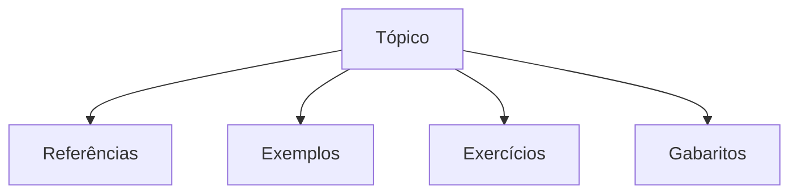

# .net-core
Exercícios e Laboratórios sobre .NET Core

#### Sobre

Olá visitante, aqui serão reunidos códigos, exemplos, gabaritos e materiais de estudo sobre cada tópico.

Eles serão separados em pastas, seguindo o formato:

> Referências: Links e materiais para estudo
> Exemplos: Exemplos de aplicação do conteúdo apresentado
> Exercícios: A fim de fixar o conteúdo
> Gabaritos: Apenas para verificar respostas

